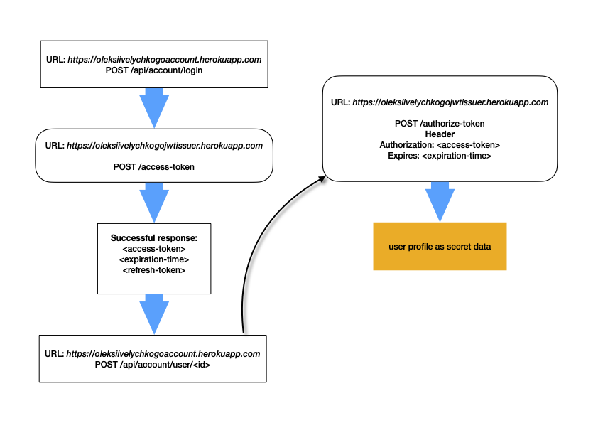

# go-account

### Microservice provides API to manage users accounts. Enhanced by third-party JWT microservice.

⚠️ [JWT issuer app](https://github.com/oleksiivelychko/go-jwt-issuer) must be running before.

