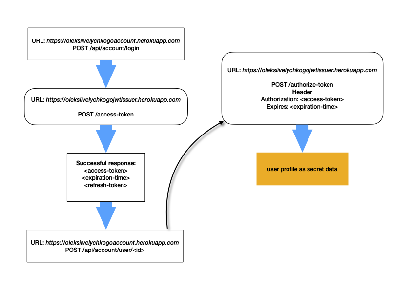

# go-account

### Microservice provides API to manage users accounts including ACL.

💡 Deployed on <a href="https://oleksiivelychkogoaccount.herokuapp.com">Heroku</a>

Run tests:
```
go clean -testcache && go test ./*/
```

Available .env variables with default values:
```
PORT=8081
DB_LOG=enable
DB_HOST=localhost
DB_PORT=5432
DB_NAME=go-postgres
DB_USER=gopher
DB_PASS=secret
DB_DRIVER=postgres
DB_SSL=require
DB_TZ=UTC
TEST_DB_HOST=localhost
TEST_DB_PORT=5433
TEST_DB_NAME=go-postgres-test
TEST_DB_USER=gopher
TEST_DB_PASS=secret
APP_JWT_URL=https://oleksiivelychkogojwtissuer.herokuapp.com
```


